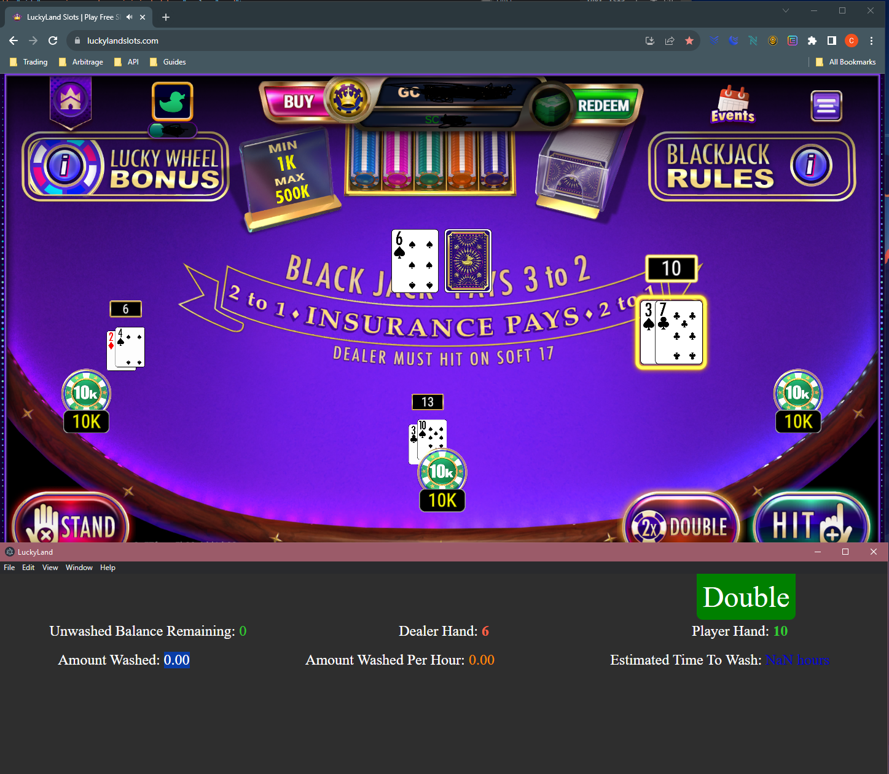

# AutomaticBlackJack

# What is this?
JS app that displays visual indicator for best action to take based on the dealer hand and your hands. Currently supports Chumba Purple BJ and LuckyLand BJ. Uses the logic from the strategy chart and Chrome remote debugger to analyze network requests, track the current Game's State, and displays the optimal action to take for perfect strategy. Supports splitting, multiple hands, doubles, etc. Also shows some analytics functions at the bottom.

# How does this work?
You just launch your chrome with an extra flag to enable remote debugging. This basically makes the dev tools available to other programs on your computer. I then created a custom program that attaches to your dev tools and reads the network data to keep track of your game state, and then implemented the logic from the strategy charts to display a visual indicator for the appropriate action based on the game state. 

This will not click the actual buttons for you, but you can move the program window directly below the game window and the Optimal Action display should line up with the actual game button, allowing you to play quickly while doing something else like watching youtube.

It also displays other helpful information, like the hands detected, Amount Remaining To Wash, Estimated Wash Per Hour, Etc.

I highly recommend to compare the Dealer/PlayerHands detected to the Actual Game as well as the actual Chart to ensure its all being detected and displayed correctly. I've tested this heavily but its definitely not bug free.

# Instructions
### If you've never touched a line of code before, first do this 

You will need to download a code editor (I personally use VS Code, available here: https://code.visualstudio.com/ )

Install nodejs: Node JS: https://nodejs.org/en

When installing nodejs make sure to check "Automatically install the necessary tools. Note this will install Chocolatey..." on Windows.

Install git, dont need to change anything from default in the installer unless you know what your doing, available here: https://gitforwindows.org/

### Clone (download) this project 

(Easy Way)

Go back to the github page for this project, and click the green Code button, then copy the link it has under HTTPS ( its https://github.com/camheff/AutomaticBlackJack.git )

Open VS Code, on the left sidebar, click the Explorer button (just above the Magnifying glass), then click the blue "Clone Repository" button. (If you dont see this, try exiting and reopening VS Code).

Paste this link into the little bar at the top of your screen for Clone from GitHub, then click "Clone from ...."

After selecting a location to download it to, once the download completes click "Open" on the popup.

Click Yes, I trust the authors.

### AFTER Cloning:

Open a VS Code Integrated Terminal by selecting ***Terminal*** then ***New Terminal*** (On the Bar on the Top Left with File, Edit, etc.)

Run the command: ***npm install***

***If you get an error try running npm install a second time***

This will install dependencies for the project so it can run. 

***The project is now installed, you just need to configure Chrome so it can be accessed by this code***.

### Setting up Chrome:
Find or create a shortcut to your Google Chrome, then right click it, select "Properties", and add " --remote-debugging-port=9222" (without the quotes, with the space in front) to the end target field.

So it should look like:  

"C:\Program Files\Google\Chrome\Application\chrome_dev.exe" --remote-debugging-port=9222 

You will probably need to either turn off your Firewall or add an exception for this Chrome in your firewall rules, otherwise it will ***probably block the remote debugger***.

To ensure this is working, launch the Chrome with this short cut, and open a command prompt (search command prompt in the Windows Start Menu) then run

netstat -an | find "9222"

This should display a line like

  TCP    127.0.0.1:9222         0.0.0.0:0              LISTENING
  
If it shows nothing, its likely a firewall issue. If it shows a bunch of entries and you cant connect program instance to it, try restarting your PC and make sure you launch the Chrome with remote debugging before any other Chrome instance. If you see a similar line your Chrome is setup correctly.

If you dont want to make a shortcut, or this doesn't make sense, you could alternatively just launch it like this: https://www.youtube.com/watch?v=LEJX645aeFU&t=3s&ab_channel=AutoTest

### Running it:
Back in your VS Code window, after running npm install, you can 

run: ***npm run start:luckyland***    

or run: ***npm run start:chumba***    

to launch the program, you need to have a remote debugger window opened at either chumba or luckyland before running the command. Only have **one single window** opened, **at the sites lobby page** when launching.

And that should be it. I would recommend **resizing the program window so that it sits right below the game window**. I made it so the indicator for what action to take roughly lines up with button position in the game. Resize the electron window as you need in order to have the button positions line up correctly.

# Weird Things to Note about Each Site
### Both:
For some reason, when you initially connect the program to your Chrome Debugger, it resizes the Chrome Window. After some research, it appears this is a bug with Puppeteer itself (so its not something I can fix sadly), but the quick work around to fix your window is just right click on the window, select Inspect, you should now see DevTools Pop Up. On the very top left of the screen, to the left of "Elements" click the little Laptop/Phone Icon Twice (Toggle device toolbar) or hit "CTRL + SHIFT + M" if you cant find it. That should fix the resolution.

### Chumba:
Launch the Code while on the main lobby page at Chumba, then open Purple BlackJack. You need to click the Sweeps Coins thing at the top atleast once (so it displays your Balance and Redeemable Balance) for the program to know those values and make the appropriate calculations for analytics.

### LuckyLand:
After Dealer BlackJack, it displays Hit instead of Repeat. It also doesn't start showing the correct values for Time, Bets Per hour, etc. until two wins. 

Since these are super minor bugs they are low priority but I will fix them eventually when I get time. The code is also pretty rough with a lot of duplicationss. This is because it was initially designed only for Chumba but LuckyLand had a ***much*** different process for how the game works with its state management and network requests and I was too lazy to make the code modular and efficient. But since this code works and I'm working on many other important automations that everyone in the group can take advantage of, these problems are low hanging fruit and this gets the job done.

# FAQ
### Are you going to make this fully automated for playing too?
Maybe in the future, but as of now im leaning towards that not being worth the risk. Automation most likely breaks TOS and is bannable. While we can ***read*** the data with a 100% guarantee of that being undetectable, **_actually interacting with the browser_** will always carry a possiblity of detection (albeit very small one). But given the size of the deposit's we're all putting on these sites its a risk im not willing to take.

### If I already memorized the chart is this program useless?
Besides the added benefit of not having to actually play/follow the game (which I find super boring and tedious), since the program ***tracks the game state through network requests*** it has access to the hand data ***before*** your screen animations complete, so **_its guaranteed to speed up your game_** (you will already see the correct action to take before the hands even finish dealing). 
It can also help prevent you from making any mistakes, very useful considering that even a single mistake can heavily effect your sessions RTP and the profitability of this method. 

### If you've found any kind of bug, have trouble getting it running, or have an interesting idea to add to it let me know in discord Camheff (@tracer6136)

# Sources For Tables:
Chumba Purple:
https://www.beatingbonuses.com/bjstrategy.php?decks2=6&h17=stand&doubleon2=9to11s&das2=on&peek2=off&surrender2=no&charlie2=no&dsa2=on&resplits2=4&resplitA=0&shuffle=0&bj=3to2&opt2=2&btn2=Generate+Strategy

LuckyLand:
https://www.beatingbonuses.com/bjstrategy.php?decks2=6&h17=stand&doubleon2=any2cards&das2=on&peek2=ace&surrender2=no&charlie2=no&resplits2=3&shuffle=0&bj=3to2&opt2=1&btn2=Generate+Strategy

# Sponsorships/Donations

This code is open source and 100% free for anyone to use, but it did take me a lot of effort and I spent a few weeks researching and working on the best way to implement something like this for everyone's benefit while I could have just been doing the 5% method during that time. If you like the software and find it useful and want to show your  appreciation the Sponsors button at the top of the Github page is the best way to do so, and I would greatly appreciate any support. Im not expecting to make anything off this but any Sponsor money I plan on using in opening my SEP IRA's, and knowing theres people out there enjoy my work enough to be willing to sponsor it would really be a dream come true.

### OmniTrader Early Access, the Automated RSA CLI

Some of the Sponsorship tiers are also eligible to get **early access to an RSA CLI program** I've been working on called OmniTrader, where the goal is to **automate RSA trading** so you can place your Buy's and Sell's accross ALL brokers with a single command rather than spending an hour inputting orders. Currently it supports TastyTrade and Tradier, with Wells Fargo, Vanguard, and others coming very soon. Its currently an active work in progress and I plan to add just about every broker used for RSA to the Project starting with the slowest and most annoying brokers to trade in first.
